# 🚀 AWS Multi-Tier Infrastructure with Terraform

[](https://www.terraform.io/)
[](https://aws.amazon.com/)
[](LICENSE)

A comprehensive **Infrastructure as Code (IaC)** project that demonstrates best practices for deploying a secure, scalable multi-tier AWS infrastructure using Terraform. This project showcases a production-ready architecture with proper security, high availability, and automated deployment.

## 📋 Table of Contents

- [🏗️ Architecture Overview](#️-architecture-overview)
- [✨ Features](#-features)
- [📁 Project Structure](#-project-structure)
- [🚀 Quick Start](#-quick-start)
- [🔧 Prerequisites](#-prerequisites)
- [📦 Installation & Setup](#-installation--setup)
- [⚙️ Configuration](#️-configuration)
- [🔐 Security Features](#-security-features)
- [📊 Infrastructure Components](#-infrastructure-components)
- [🛠️ Usage](#️-usage)
- [📸 Screenshots](#-screenshots)
- [🤝 Contributing](#-contributing)
- [📄 License](#-license)

## 🏗️ Architecture Overview

This project implements a **three-tier architecture** with the following components:

```mermaid
graph TB
    subgraph "Internet"
        User[🌐 Users]
    end
    
    subgraph "AWS Cloud"
        subgraph "Public Tier"
            ALB[🔄 Application Load Balancer]
            ACM[🔒 SSL Certificate]
            Bastion[🛡️ Bastion Host]
        end
        
        subgraph "Private Tier"
            App1[🖥️ Private EC2 Instance 1]
            App2[🖥️ Private EC2 Instance 2]
        end
        
        subgraph "Database Tier"
            DB[🗄️ Database Subnets]
        end
        
        subgraph "Backend Infrastructure"
            S3[🪣 S3 Backend]
            DynamoDB[🗃️ DynamoDB Locks]
        end
    end
    
    User --> ALB
    ALB --> App1
    ALB --> App2
    Bastion --> App1
    Bastion --> App2
    App1 --> DB
    App2 --> DB
```



### 🏛️ Infrastructure Layers

| Layer | Components | Purpose |
|-------|------------|---------|
| **Public Tier** | ALB, Bastion Host, ACM Certificate | External access and management |
| **Private Tier** | EC2 Instances (App Servers) | Application hosting |
| **Database Tier** | Private Subnets | Database isolation |
| **Backend** | S3 + DynamoDB | Terraform state management |

## ✨ Features

### 🔒 Security & Compliance
- **VPC with Public/Private Subnets** - Network isolation
- **Security Groups** - Granular access control
- **Bastion Host** - Secure SSH access to private instances
- **SSL/TLS Encryption** - ACM certificate for HTTPS
- **State Encryption** - S3 backend with encryption

### 🚀 High Availability
- **Multi-AZ Deployment** - Across 2 availability zones
- **Load Balancer** - Application Load Balancer with health checks
- **Auto Scaling Ready** - Infrastructure prepared for scaling

### 🛠️ DevOps & Automation
- **Infrastructure as Code** - Complete Terraform automation
- **Remote State Management** - S3 backend with DynamoDB locking
- **Modular Design** - Reusable Terraform modules
- **Version Control** - Git-based deployment

### 📊 Monitoring & Management
- **Health Checks** - ALB health monitoring
- **Logging** - CloudWatch integration ready
- **Tagging Strategy** - Consistent resource tagging

## 📁 Project Structure

```
PP-Demo/
├── 📦 S3&DynamoDB/           # Backend infrastructure
│   ├── s3.tf                 # S3 bucket & DynamoDB table
│   ├── variables.tf          # Backend variables
│   ├── outputs.tf            # Backend outputs
│   ├── random.tf             # Unique resource naming
│   └── README.md             # Backend documentation
│
├── 🏗️ Terraform/              # Main infrastructure
│   ├── 0-backend.tf          # S3 backend configuration
│   ├── 1-versions-providers.tf # Terraform & AWS provider setup
│   ├── 2-generic-variables.tf # Global variables
│   ├── 3-locals.tf           # Local values & tags
│   ├── 4-1-vpc.tf            # VPC & networking
│   ├── 4-2-vpc-variables.tf  # VPC variables
│   ├── 4-3-vpc-outputs.tf    # VPC outputs
│   ├── 5-1-Bastion-SG.tf     # Bastion security group
│   ├── 5-2-Bastion-SG-outputs.tf
│   ├── 5-3-private-EC2-SG.tf # Private EC2 security group
│   ├── 5-4-private-EC2-SG-outputs.tf
│   ├── 6-data-source-ami.tf  # AMI data source
│   ├── 7-1-bastion-ec2.tf    # Bastion host
│   ├── 7-2-bastion-ec2-variables.tf
│   ├── 7-3-private-ec2.tf    # Private EC2 instances
│   ├── 7-4-ec2-outputs.tf    # EC2 outputs
│   ├── 8-1-elastic-ip.tf     # Elastic IP for bastion
│   ├── 9-null-resource.tf    # Provisioning scripts
│   ├── 10-alb.tf             # Application Load Balancer
│   ├── 10-1-alb-sg.tf        # ALB security group
│   ├── 11-acm.tf             # SSL certificate
│   ├── 12-alias.tf           # Route53 alias
│   ├── app1.sh               # Application setup script
│   ├── app2.sh               # Application setup script
│   └── bastion-ip.txt        # Bastion IP output
│
└── 📸 assets/
    └── Images/
        └── Initiating-Backend.jpg
```

## 🚀 Quick Start

### 1. Clone the Repository
```bash
git clone <repository-url>
cd PP-Demo
```

### 2. Setup Backend Infrastructure
```bash
cd S3&DynamoDB
terraform init
terraform apply -auto-approve
```

### 3. Deploy Main Infrastructure
```bash
cd ../Terraform
terraform init
terraform plan
terraform apply
```

## 🔧 Prerequisites

### Required Software
- **Terraform** >= 1.2.0
- **AWS CLI** configured with appropriate credentials
- **Git** for version control

### AWS Requirements
- **AWS Account** with appropriate permissions
- **AWS Profile** configured (default: "My-Portfolio")
- **EC2 Key Pair** for SSH access
- **Domain Name** (optional, for SSL certificate)

### IAM Permissions
Your AWS user/role needs permissions for:
- EC2 (instances, security groups, EIP)
- VPC (VPC, subnets, route tables, internet gateway, NAT gateway)
- ELB (Application Load Balancer)
- ACM (SSL certificates)
- S3 (backend storage)
- DynamoDB (state locking)
- Route53 (DNS management)

## 📦 Installation & Setup

### Step 1: Configure AWS Credentials
```bash
aws configure --profile My-Portfolio
```

### Step 2: Create EC2 Key Pair
```bash
aws ec2 create-key-pair --key-name your-key-name --query 'KeyMaterial' --output text > your-key-name.pem
chmod 400 your-key-name.pem
```

### Step 3: Update Variables
Edit `Terraform/2-generic-variables.tf`:
```hcl
variable "key_name" {
  description = "Name of the EC2 key pair"
  type        = string
  default     = "your-key-name"  # Update this
}
```

## ⚙️ Configuration

### Environment Variables
```bash
export AWS_PROFILE=My-Portfolio
export AWS_REGION=us-east-1
```

### Key Configuration Files

#### Backend Configuration (`S3&DynamoDB/`)
- **s3.tf**: S3 bucket and DynamoDB table for state management
- **variables.tf**: Backend-specific variables
- **outputs.tf**: Backend resource outputs

#### Main Infrastructure (`Terraform/`)
- **0-backend.tf**: Remote state configuration
- **1-versions-providers.tf**: Terraform and AWS provider setup
- **2-generic-variables.tf**: Global variables
- **3-locals.tf**: Common tags and local values

### Customization Options

#### VPC Configuration
```hcl
# Edit Terraform/4-2-vpc-variables.tf
variable "cidr_block" {
  description = "VPC CIDR block"
  type        = string
  default     = "10.0.0.0/16"  # Customize as needed
}
```

#### Instance Configuration
```hcl
# Edit Terraform/7-2-bastion-ec2-variables.tf
variable "instance_type" {
  description = "EC2 instance type"
  type        = string
  default     = "t3.micro"  # Adjust based on needs
}
```

## 🔐 Security Features

### Network Security
- **VPC Isolation**: Private subnets for application servers
- **Security Groups**: Granular access control
- **Bastion Host**: Secure SSH access to private instances
- **NAT Gateway**: Private instances can access internet securely

### Data Security
- **S3 Encryption**: Backend state files encrypted at rest
- **SSL/TLS**: HTTPS traffic encryption
- **IAM Roles**: Least privilege access

### Access Control
- **SSH Key Authentication**: Secure EC2 access
- **Security Group Rules**: Specific port access
- **Private Subnets**: Application servers isolated from internet

## 📊 Infrastructure Components

### 🏗️ Networking
| Component | Purpose | CIDR |
|-----------|---------|------|
| VPC | Main network | 10.0.0.0/16 |
| Public Subnets | ALB, Bastion | 10.0.1.0/24, 10.0.2.0/24 |
| Private Subnets | Application Servers | 10.0.3.0/24, 10.0.4.0/24 |
| Database Subnets | Database Layer | 10.0.5.0/24, 10.0.6.0/24 |

### 🖥️ Compute Resources
| Component | Type | Purpose |
|-----------|------|---------|
| Bastion Host | t3.micro | Secure SSH access |
| Private EC2 1 | t3.micro | Application server |
| Private EC2 2 | t3.micro | Application server |

### 🔄 Load Balancing
| Component | Type | Features |
|-----------|------|----------|
| ALB | Application Load Balancer | HTTPS, Health checks, SSL termination |

## 🛠️ Usage

### Deploy Infrastructure
```bash
# Initialize and apply backend
cd S3&DynamoDB
terraform init
terraform apply -auto-approve

# Deploy main infrastructure
cd ../Terraform
terraform init
terraform plan
terraform apply
```

### Access Your Infrastructure
```bash
# Get bastion host IP
cat bastion-ip.txt

# SSH to bastion host
ssh -i your-key-name.pem ec2-user@<bastion-ip>

# From bastion, SSH to private instances
ssh -i your-key-name.pem ec2-user@<private-instance-ip>
```

### Destroy Infrastructure
```bash
# Destroy main infrastructure
cd Terraform
terraform destroy

# Destroy backend (after main infrastructure)
cd ../S3&DynamoDB
terraform destroy
```

### Useful Commands
```bash
# View current state
terraform show

# List resources
terraform state list

# Refresh state
terraform refresh

# Validate configuration
terraform validate
```

## 📸 Screenshots

### Backend Initialization


*S3 bucket and DynamoDB table creation for Terraform state management*

## 🤝 Contributing

We welcome contributions! Please follow these steps:

1. **Fork** the repository
2. **Create** a feature branch (`git checkout -b feature/amazing-feature`)
3. **Commit** your changes (`git commit -m 'Add amazing feature'`)
4. **Push** to the branch (`git push origin feature/amazing-feature`)
5. **Open** a Pull Request

### Development Guidelines
- Follow Terraform best practices
- Use consistent naming conventions
- Add proper documentation
- Include variable validation
- Test changes thoroughly

## 📄 License

This project is licensed under the MIT License - see the [LICENSE](LICENSE) file for details.

---

## 🙏 Acknowledgments

- **HashiCorp** for Terraform
- **AWS** for cloud infrastructure
- **Terraform AWS Modules** for reusable infrastructure components

---

<div align="center">

**Built with ❤️ using Terraform and AWS**

[](https://www.terraform.io/)
[](https://aws.amazon.com/)

</div> 