# 🏗️ AWS Infrastructure with Terraform

[](https://www.terraform.io/)
[](https://aws.amazon.com/)

This directory contains the complete Terraform configuration for deploying a **production-ready AWS infrastructure** with multi-tier architecture, security best practices, and automated deployment.

## 📋 Table of Contents

- [🏗️ Infrastructure Overview](#️-infrastructure-overview)
- [📁 File Structure](#-file-structure)
- [⚙️ Configuration](#️-configuration)
- [🚀 Deployment](#-deployment)
- [🔐 Security](#-security)
- [🌐 Networking](#-networking)
- [🖥️ Compute Resources](#️-compute-resources)
- [🔗 Load Balancing](#-load-balancing)
- [🔒 SSL/TLS](#-ssltls)
- [📊 Monitoring](#-monitoring)
- [🛠️ Customization](#️-customization)

## 🏗️ Infrastructure Overview

This Terraform configuration deploys a **three-tier architecture** with the following components:

```mermaid
graph TB
    subgraph "Internet"
        User[🌐 Users]
        DNS[🌍 Route53]
    end
    
    subgraph "AWS Cloud"
        subgraph "Public Tier"
            ALB[🔄 Application Load Balancer]
            ACM[🔒 SSL Certificate]
            Bastion[🛡️ Bastion Host]
            EIP[📍 Elastic IP]
        end
        
        subgraph "Private Tier"
            App1[🖥️ Private EC2 Instance 1]
            App2[🖥️ Private EC2 Instance 2]
        end
        
        subgraph "Database Tier"
            DB[🗄️ Database Subnets]
        end
        
        subgraph "Security"
            SG1[Bastion SG]
            SG2[Private EC2 SG]
            SG3[ALB SG]
        end
    end
    
    User --> DNS
    DNS --> ALB
    ALB --> App1
    ALB --> App2
    Bastion --> App1
    Bastion --> App2
    EIP --> Bastion
```



## 📁 File Structure

```
Terraform/
├── 📋 Configuration Files
│   ├── 0-backend.tf                    # S3 backend configuration
│   ├── 1-versions-providers.tf         # Terraform & AWS provider setup
│   ├── 2-generic-variables.tf          # Global variables
│   └── 3-locals.tf                     # Local values & common tags
│
├── 🌐 Networking
│   ├── 4-1-vpc.tf                      # VPC & subnet configuration
│   ├── 4-2-vpc-variables.tf            # VPC variables
│   └── 4-3-vpc-outputs.tf              # VPC outputs
│
├── 🔐 Security Groups
│   ├── 5-1-Bastion-SG.tf               # Bastion host security group
│   ├── 5-2-Bastion-SG-outputs.tf       # Bastion SG outputs
│   ├── 5-3-private-EC2-SG.tf           # Private EC2 security group
│   └── 5-4-private-EC2-SG-outputs.tf   # Private EC2 SG outputs
│
├── 🖥️ Compute Resources
│   ├── 6-data-source-ami.tf             # AMI data source
│   ├── 7-1-bastion-ec2.tf              # Bastion host
│   ├── 7-2-bastion-ec2-variables.tf    # Bastion variables
│   ├── 7-3-private-ec2.tf              # Private EC2 instances
│   ├── 7-4-ec2-outputs.tf              # EC2 outputs
│   └── 8-1-elastic-ip.tf               # Elastic IP for bastion
│
├── 🔄 Load Balancing
│   ├── 10-alb.tf                       # Application Load Balancer
│   └── 10-1-alb-sg.tf                  # ALB security group
│
├── 🔒 SSL/TLS & DNS
│   ├── 11-acm.tf                       # SSL certificate
│   └── 12-alias.tf                     # Route53 alias record
│
├── ⚙️ Automation
│   ├── 9-null-resource.tf              # Provisioning automation
│   ├── app1.sh                         # Application setup script
│   ├── app2.sh                         # Application setup script
│   └── bastion-ip.txt                  # Bastion IP output
│
└── 📄 README.md                        # This file
```

## ⚙️ Configuration

### 🔧 Global Variables (`2-generic-variables.tf`)

```hcl
variable "aws_region" {
  default = "us-east-1"
}

variable "environment" {
  default = "dev"
}

variable "website_division" {
  default = "self"
}
```

### 🏷️ Common Tags (`3-locals.tf`)

```hcl
locals {
  owners = var.website_division
  environment = var.environment
  name = "$(var.website_division)-$(var.environment)"
  common_tags = {
    owners = local.owners
    environment = local.environment
  }
}
```

### 🌐 VPC Configuration (`4-2-vpc-variables.tf`)

| Component | CIDR Block | Purpose |
|-----------|------------|---------|
| VPC | 10.0.0.0/16 | Main network |
| Public Subnets | 10.0.0.0/24, 10.0.1.0/24 | ALB, Bastion |
| Private Subnets | 10.0.2.0/24, 10.0.3.0/24 | Application servers |
| Database Subnets | 10.0.4.0/24, 10.0.5.0/24 | Database layer |

### 🖥️ Compute Configuration (`7-2-bastion-ec2-variables.tf`)

```hcl
variable "instance_type" {
  default = "t2.micro"
}

variable "key_name" {
  default = "PP-Key"
}
```

## 🚀 Deployment

### Prerequisites

1. **AWS CLI Configuration**
   ```bash
   aws configure --profile My-Portfolio
   ```

2. **EC2 Key Pair**
   ```bash
   aws ec2 create-key-pair --key-name PP-Key --query 'KeyMaterial' --output text > PP-Key.pem
   chmod 400 PP-Key.pem
   ```

3. **Domain Setup** (for SSL certificate)
   - Ensure `venkatasaicharan.com` is configured in Route53
   - Domain should be active and accessible

### Deployment Steps

#### 1. Initialize Terraform
```bash
terraform init
```

#### 2. Review the Plan
```bash
terraform plan
```

#### 3. Apply the Configuration
```bash
terraform apply
```

#### 4. Verify Deployment
```bash
terraform show
terraform output
```

## 🔐 Security

### Security Groups

#### Bastion Host Security Group (`5-1-Bastion-SG.tf`)
- **SSH Access**: Port 22 from your IP
- **Purpose**: Secure access to private instances

#### Private EC2 Security Group (`5-3-private-EC2-SG.tf`)
- **HTTP Access**: Port 80 from ALB
- **SSH Access**: Port 22 from Bastion host
- **Purpose**: Application server security

#### ALB Security Group (`10-1-alb-sg.tf`)
- **HTTP Access**: Port 80 from internet
- **HTTPS Access**: Port 443 from internet
- **Purpose**: Load balancer security

### Network Security Features
- ✅ **VPC Isolation**: Private subnets for application servers
- ✅ **NAT Gateway**: Secure internet access for private instances
- ✅ **Security Groups**: Granular access control
- ✅ **Bastion Host**: Secure SSH access to private instances

## 🌐 Networking

### VPC Architecture (`4-1-vpc.tf`)

```hcl
module "vpc-PP" {
  source = "terraform-aws-modules/vpc/aws"
  version = "6.0.1"
  
  name = "vpc-${var.environment}"
  cidr = var.cidr_block
  azs = slice(data.aws_availability_zones.Demo.names, 0, 2)
  
  public_subnets = var.public_subnet_cidr
  private_subnets = var.private_subnet_cidr
  database_subnets = var.database_subnet_cidr
  
  enable_nat_gateway = true
  single_nat_gateway = true
  create_igw = true
}
```

### Network Features
- **Multi-AZ Deployment**: Across 2 availability zones
- **Public Subnets**: For ALB and Bastion host
- **Private Subnets**: For application servers
- **Database Subnets**: For future database deployment
- **NAT Gateway**: For private instance internet access

## 🖥️ Compute Resources

### Bastion Host (`7-1-bastion-ec2.tf`)
```hcl
module "bastion_instance" {
  source = "terraform-aws-modules/ec2-instance/aws"
  version = "6.0.2"
  
  ami = data.aws_ami.amzlinux2.id
  instance_type = var.instance_type
  key_name = var.key_name
  vpc_security_group_ids = [module.bastion_security_group.security_group_id]
  subnet_id = module.vpc-PP.public_subnets[0]
}
```

### Private EC2 Instances (`7-3-private-ec2.tf`)
- **Instance Type**: t2.micro (configurable)
- **AMI**: Amazon Linux 2
- **User Data**: Application setup scripts
- **Security**: Private subnets with bastion access

### Application Setup Scripts

#### app1.sh / app2.sh
```bash
#!/bin/bash
# EC2 User Data Script to Host Static Version of venkatasaicharan.com

sudo yum update -y
sudo yum install -y httpd wget
sudo systemctl enable httpd
sudo systemctl start httpd

# Download and setup website
sudo wget --mirror --convert-links --adjust-extension --page-requisites --no-parent https://venkatasaicharan.com -P /var/www/html
sudo cp -r /var/www/html/venkatasaicharan.com/* /var/www/html/
sudo chown -R apache:apache /var/www/html
```

## 🔗 Load Balancing

### Application Load Balancer (`10-alb.tf`)

#### Target Group Configuration
- **Protocol**: HTTP
- **Port**: 80
- **Health Check**: `/venkatasaicharan.com/index.html`
- **Health Check Interval**: 30 seconds
- **Healthy Threshold**: 3
- **Unhealthy Threshold**: 3

#### Listener Configuration
- **HTTP Listener**: Port 80 → Target Group
- **HTTPS Listener**: Port 443 → Target Group (with SSL certificate)

#### Load Balancing Features
- ✅ **Health Checks**: Automatic instance health monitoring
- ✅ **SSL Termination**: HTTPS support with ACM certificate
- ✅ **Cross-Zone Load Balancing**: High availability
- ✅ **Sticky Sessions**: Session persistence (if needed)

## 🔒 SSL/TLS

### ACM Certificate (`11-acm.tf`)
```hcl
module "acm" {
  source = "terraform-aws-modules/acm/aws"
  version = "6.0.0"
  
  domain_name = data.aws_route53_zone.dns_zone.name
  zone_id = data.aws_route53_zone.dns_zone.id
  subject_alternative_names = [
    "venkatasaicharan.com",
    "*.venkatasaicharan.com"
  ]
  validation_method = "DNS"
}
```

### DNS Configuration (`12-alias.tf`)
```hcl
resource "aws_route53_record" "alias_record" {
  zone_id = data.aws_route53_zone.dns_zone.zone_id
  name = "app.venkatasaicharan.com"
  type = "A"
  
  alias {
    name = module.alb.dns_name
    zone_id = module.alb.zone_id
    evaluate_target_health = true
  }
}
```

## 📊 Monitoring

### Health Checks
- **Path**: `/venkatasaicharan.com/index.html`
- **Protocol**: HTTP
- **Port**: Traffic port
- **Interval**: 30 seconds
- **Timeout**: 6 seconds
- **Healthy Threshold**: 3
- **Unhealthy Threshold**: 3

### Logging (Ready for Implementation)
- **CloudWatch Logs**: Can be enabled for ALB
- **Application Logs**: Apache logs on EC2 instances
- **Security Logs**: Security group flow logs

## 🛠️ Customization

### Instance Types
Edit `7-2-bastion-ec2-variables.tf`:
```hcl
variable "instance_type" {
  default = "t3.micro"  # Change as needed
}
```

### VPC CIDR
Edit `4-2-vpc-variables.tf`:
```hcl
variable "cidr_block" {
  default = "10.0.0.0/16"  # Customize as needed
}
```

### Domain Configuration
Edit `11-acm.tf` and `12-alias.tf`:
```hcl
# Change domain name
data "aws_route53_zone" "dns_zone" {
  name = "your-domain.com"  # Update this
}
```

### Application Setup
Edit `app1.sh` and `app2.sh`:
```bash
# Change the website URL
sudo wget --mirror --convert-links --adjust-extension --page-requisites --no-parent https://your-website.com -P /var/www/html
```

## 🔧 Useful Commands

### Terraform Operations
```bash
# Initialize
terraform init

# Plan deployment
terraform plan

# Apply changes
terraform apply

# Destroy infrastructure
terraform destroy

# Show current state
terraform show

# List resources
terraform state list

# Refresh state
terraform refresh

# Validate configuration
terraform validate
```

### Access Infrastructure
```bash
# Get bastion IP
cat bastion-ip.txt

# SSH to bastion
ssh -i PP-Key.pem ec2-user@<bastion-ip>

# From bastion, SSH to private instances
ssh -i /tmp/PP-Key.pem ec2-user@<private-instance-ip>
```

### Monitoring
```bash
# Check ALB health
aws elbv2 describe-target-health --target-group-arn <target-group-arn>

# Check EC2 instances
aws ec2 describe-instances --filters "Name=tag:Name,Values=*"

# Check security groups
aws ec2 describe-security-groups --group-names <security-group-name>
```

---

## 📄 Outputs

After successful deployment, you'll get:

- **Bastion Host IP**: Available in `bastion-ip.txt`
- **ALB DNS Name**: From Terraform outputs
- **SSL Certificate**: Validated and attached to ALB
- **Route53 Record**: `app.venkatasaicharan.com` pointing to ALB

---

<div align="center">

**Built with ❤️ using Terraform and AWS**

[](https://www.terraform.io/)
[](https://aws.amazon.com/)

</div> 